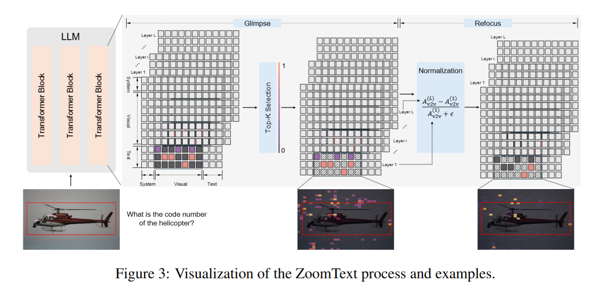
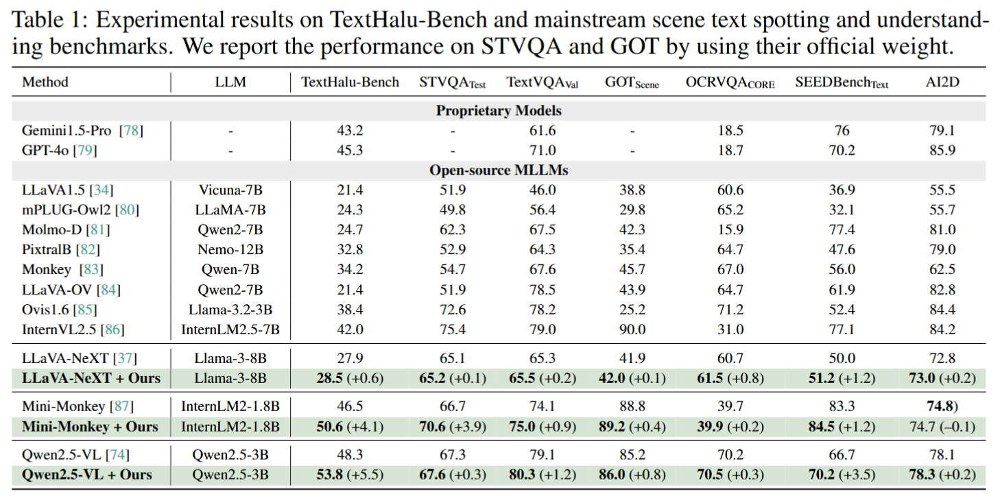

# MLLM-Semantic-Hallucination


<!-- [](https://opensource.org/licenses/MIT)
[](https://arxiv.org/abs/2410.11779)
[](https://github.com/huggingface/transformers)
[](https://github.com/shikiw/OPERA/stargazers) -->

<p align="center">
  <a href="https://arxiv.org/abs/2506.05551">📄arXiv</a> •
  <a href="https://huggingface.co/papers/2506.05551">🤗HFPaper</a> •
</p>


This repository provides the official PyTorch implementation of the following paper: 
> [**When Semantics Mislead Vision:Mitigating Large Multimodal Models Hallucinationsin Scene Text Spotting and Understanding**]() <br>
> Yan Shu<sup>1</sup>, Hangui Lin<sup>2</sup>,   Yexin Liu<sup>3</sup>,
> Yan Zhang<sup>4,5</sup>,   Gangyan Zeng<sup>6</sup>,   Yan Li<sup>3</sup>,  Yu Zhou<sup>7</sup>,  Ser-Nam Lim<sup>8</sup>,   Harry Yang<sup>2</sup>,   Nicu Sebe<sup>1</sup>
> <br>
> <sup>1</sup>University of Trento (UNITN),   <sup>2</sup>University of International Relations (UIR), <sup>3</sup>The Hong Kong University of Science and Technology (HKUST),    <sup>4</sup>Institute of Information Engineering, Chinese Academy of Sciences (IIE, CAS),   <sup>5</sup>University of Chinese Academy of Sciences (UCAS),   <sup>6</sup>Nanjing University of Science and Technology (NJUST),  <sup>7</sup>Nankai University (NKU),  <sup>8</sup>University of Central Florida (UCF)


## Overview

<p align="center"></p>

  Large Multimodal Models (LMMs) have achieved impressive progress in visualperception and reasoning. However, when confronted with visually ambiguous ornon-semantic scene text, they often struggle to accurately spot and understand thecontent, frequently generating semantically plausible yet visually incorrect answers,which we refer to as semantic hallucination. In this work, we investigate the un-derlying causes of semantic hallucination and identify a key finding: Transformerlayers in LLM with stronger attention focus on scene text regions are less prone to producing semantic hallucinations. Thus, we propose a training-free semantic hal-lucination mitigation framework comprising two key components: (1) ZoomText,a coarse-to-fine strategy that identifies potential text regions without external detec-tors; and (2) Grounded Layer Correction, which adaptively leverages the internalrepresentations from layers less prone to hallucination to guide decoding, correct-ing hallucinated outputs for non-semantic samples while preserving the semanticsof meaningful ones. To enable rigorous evaluation, we introduce TextHalu-Bench,a benchmark of over 1,730 samples spanning both semantic and non-semanticcases, with manually curated question–answer pairs designed to probe model hallu-cinations. Extensive experiments demonstrate that our method not only effectivelymitigates semantic hallucination but also achieves strong performance on publicbenchmarks for scene text spotting and understanding.


## Setup

### Qwen2.5-VL

We follow the official inplement of [Qwen2.5-VL](https://github.com/QwenLM/Qwen2.5-VL) and replace the transformer use following code.

```
cd MLLM-Semantic-Hallucination/Qwen
pip install .
```

### MiniMonkey

We follow the official inplement of [MiniMonkey](https://github.com/Yuliang-Liu/Monkey/tree/main/project/mini_monkey) and download their [official weight](https://huggingface.co/mx262/MiniMonkey).
Then we replace their code modeling_internlm2.py and modeling_minimonkey_chat.py with code [here](https://github.com/shuyansy/MLLM-Semantic-Hallucination/tree/master/minimonkey)

### LLaVA-NeXT 
We follow the steps below for inplement of LLaVA-NeXT .

```
cd llava-next
conda create -n llava python=3.10 -y
conda activate llava
pip install --upgrade pip  # Enable PEP 660 support.
pip install -e ".[train]"
pip install .
```


##  Quickstart

After setup the environment, you can directly use our method on MLLMs model by:

### Qwen2.5-VL

```
from transformers import Qwen2_5_VLForConditionalGeneration, AutoProcessor
from qwen_vl_utils import process_vision_info


model = Qwen2_5_VLForConditionalGeneration.from_pretrained(
    "/scqian/Qwen2.5-VL-3B-Instruct", torch_dtype="auto", device_map="auto"
)


processor = AutoProcessor.from_pretrained("/scqian/Qwen2.5-VL-3B-Instruct")
image_path="your/path/to/image"
question ="your question"
messages = [
    {
        "role": "user",
        "content": [
            {
                "type": "image",
                "image": image_path,
            },
            {"type": "text", "text": question},
        ],
    }
]

# Preparation for inference
text = processor.apply_chat_template(
    messages, tokenize=False, add_generation_prompt=True
)
image_inputs, video_inputs = process_vision_info(messages)
inputs = processor(
    text=[text],
    images=image_inputs,
    videos=video_inputs,
    padding=True,
    return_tensors="pt",
)
inputs = inputs.to(model.device)


# Inference: Generation of the output

image_token_id = 151655
idx = (inputs.input_ids == image_token_id).nonzero(as_tuple=True)
first_token_idx = idx[1][0].item()
last_token_idx = idx[1][-1].item()
generated_ids = model.generate(
    **inputs,
    max_new_tokens=128,
    img_token_idx=first_token_idx,
    qs_token_idx=last_token_idx
)


generated_ids_trimmed = [
    out_ids[len(in_ids) :] for in_ids, out_ids in zip(inputs.input_ids, generated_ids)
]

output_text = processor.batch_decode(
    generated_ids_trimmed, skip_special_tokens=True, clean_up_tokenization_spaces=False
)
print(output_text)
```

### MiniMonkey

We use their original official [demo](https://huggingface.co/mx262/MiniMonkey/blob/main/demo.py).

### LLaVA-NeXT 

We use their original official [demo](https://github.com/LLaVA-VL/LLaVA-NeXT/blob/main/docs/LLaVA-NeXT.md).

## Evaluation


### TextHalu-Bench

- Download the TexHalu-Bench in ./eval and unzip it.
```bash
git clone https://huggingface.co/datasets/LinYuanMo/TextHalu-Bench
```

- Replace the models' initiation and inference process and evaluate them.
```bash
python eval/eval_texthalubench.py
```

### STVQA

- Download the STVQA annotations file in [here](https://rrc.cvc.uab.es/?ch=11) and evaluate it using the your inference outcome file:
```bash
python eval/eval_stvqa.py
```


### VLMKIT

We use [Vlmkit](https://github.com/open-compass/VLMEvalKit) to evaluate the TextVQA OCRVQA SEEDBench AI2D.


###  Experiment's Results

<p align="center"></p>


## Citation
If you find this work useful for your research, please cite [our paper](https://arxiv.org/abs/2506.05551):
```
@article{shu2025semantics,
  title={When Semantics Mislead Vision: Mitigating Large Multimodal Models Hallucinations in Scene Text Spotting and Understanding},
  author={Shu, Yan and Lin, Hangui and Liu, Yexin and Zhang, Yan and Zeng, Gangyan and Li, Yan and Zhou, Yu and Lim, Ser-Nam and Yang, Harry and Sebe, Nicu},
  journal={arXiv preprint arXiv:2506.05551},
  year={2025}
}
```
